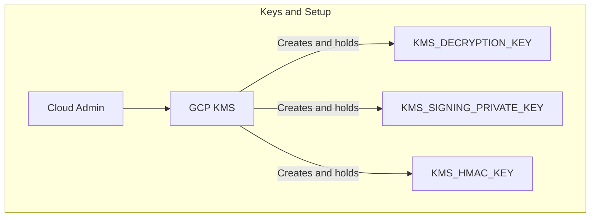
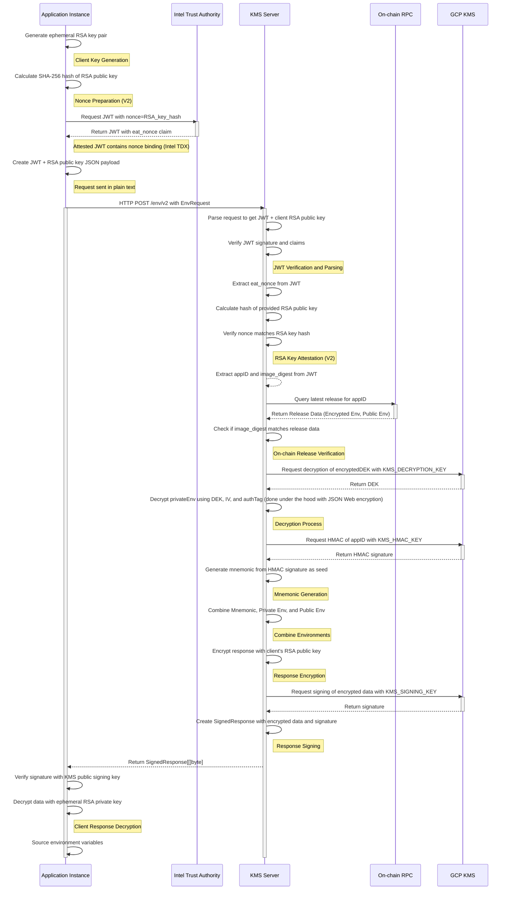

# KMS

# What is the purpose of a KMS?

1. Serve encrypted secrets to applications. Secrets are known by the application developer but are encrypted before being posted onchain and only decryptable with cooperation from the KMS.
2. Provision persistent private keys to applications. These private keys are known to no one except for the KMS and the application softwate. If the application software leaks them (by bug or by choice) then that is a consequence of the application and out of scope for the KMS to mitigate.
    - Application level decryption keys, Etherum private keys, TLS private keys, and more can be derived from this
3. Prove the integrity of (1) and (2) to applications and users.

# What are the desired properties of a KMS?

1. Only the latest onchain whitelisted code for a given application has access to its secrets and private keys.
2. The latest onchain whitelisted code for a given application always has access to its secrets and private keys, even in the case of a major operational failure.

Obviously, these properties aren't black and white. Different implementations will have these properties with varying degrees of strength.

# KMS Mainnet Alpha MVP

In our mainnet alpha, the KMS serves secrets and a bip39 mnemonic to applications. The canonical usage of these values is as environment variables and are referred to as such in this section.

## Diagrams





## Setup

The KMS system is initialized with 3 keys:

1. An RSA asymmetric encryption/decryption key `KMS_DECRYPTION_KEY` with algorithm `rsa-decrypt-oaep-4096-sha256` 
2. An HMAC key `KMS_HMAC_KEY` with algorithm `hmac-sha256` 
3. An asymmetric signing key `KMS_SIGNING_PRIVATE_KEY` with algorithm `ec-sign-p256-sha256` for signing KMS responses

All of these are created in GCP KMS by a cloud account admin. In addition, the KMS's code can be upgraded by a cloud admin.

The KMS server Docker image then started in a Google Confidential Spaces that has decryption and signing capabilities with the above keys.

`KMS_ENCRYPTION_KEY` and `KMS_SIGNING_PUBLIC_KEY` are made global protocol variables that everyone has access to.

TODO: specify exact permissions

## Env Retrieval

The KMS server exposes two endpoints for environment retrieval:

- **`/env` (V1)**: Basic encrypted authentication with Google CS attestations - **will be removed soon**
- **`/env/v2` (V2)**: Enhanced security with RSA key attestation via nonce using Intel Trust Authority attestations

Both endpoints are available to all Google Confidential Spaces instances and are rate-limited per IP address to prevent abuse.

### V1 Endpoint (`/env`) - will be removed soon

This endpoint uses encrypted authentication to prevent man-in-the-middle attacks. The client must:

1. **Generate ephemeral RSA key pair** (4096-bit) for the request
2. **Create authentication payload** in the following JSON format:
   ```json
   {
     "jwt": "eyJ0eXAiOiJKV1QiLCJhbGciOiJSUzI1NiJ9...",
     "rsa_public_key": "-----BEGIN PUBLIC KEY-----\nMIICIjANBgkqhkiG9w0BAQEFAAOCAg8A...\n-----END PUBLIC KEY-----"
   }
   ```
   Where `jwt` is the JWT generated as a launch attestation for every Google CS.
3. **Encrypt the payload** using the KMS server's `KMS_ENCRYPTION_KEY` using JSON Web Encryption.
4. **Send POST request** to `/env` endpoint with the encrypted jwt+RSA public key into an `EnvRequest` as the request body

### V2 Endpoint (`/env/v2`) - RSA Key Attestation

The V2 endpoint adds cryptographic binding between the JWT attestation and the RSA public key to prevent key substitution attacks. The client must:

1. **Generate ephemeral RSA key pair** (4096-bit) for the request
2. **Calculate RSA key hash**: Compute the SHA-256 hash of the RSA public key PEM with the `ENV_REQUEST_RSA_KEY` header
3. **Request attested JWT with nonce**: Request a JWT from Intel Trust Authority (via Google Confidential Space) with the RSA key hash as the `eat_nonce` field
4. **Create authentication payload**:
   ```json
   {
     "jwt": "eyJ0eXAiOiJKV1QiLCJhbGciOiJSUzI1NiJ9...",  // JWT containing the nonce
     "rsa_public_key": "-----BEGIN PUBLIC KEY-----\n..."
   }
   ```
5. **Send POST request** to `/env/v2` endpoint (request is sent in plain text)

The KMS server will:
- Parse the request to get the JWT and RSA public key
- Verify the JWT attestation as usual
- Extract the `eat_nonce` claim from the JWT
- Calculate the expected hash of the provided RSA public key
- Verify that the nonce matches the RSA key hash, proving the key was generated inside the TEE
- Encrypt the response with the client's attested RSA public key

This prevents attackers from substituting their own RSA public key to intercept secrets, as they cannot generate a valid JWT with the correct nonce without running inside the authorized TEE. The request does not need to be encrypted because the response is encrypted with the attested RSA public key, ensuring only the TEE can decrypt the secrets. 

### JWT Verification and Confidential Spaces Checks

The `jwt` ([example](https://gist.github.com/solimander/41fe9d3e134bfa5918fd562ca4924d8e#file-payload-json-L51)) is verified to be signed by a key in the appropriate JWKS (JSON Web Key Set):

- **V1 endpoint**: Uses [Google CS JWKS](https://cloud.google.com/confidential-computing/confidential-space/docs/reference/token-validation-endpoint-fields)
- **V2 endpoint**: Uses [Intel Trust Authority JWKS](https://portal.trustauthority.intel.com/certs)

The token is then verified to be attested to be

1. running in an Intel TDX based Google Confidential Space
2. with a STABLE production OS image

The `appID` (the address of the app contract for the application) is parsed from the name of the requesting instance.

### Onchain Release Verification

The KMS server then consults a provided RPC for the latest `AppUpgraded` for the `appID` from the `AppController` address. The `image_digest` in `jwt` is checked to be the same as the expected digest of the latest release. The release also includes the `encryptedEnv` (secrets) and `publicEnv`.

### Encrypted Env Decryption and Mnemonic Generation

The `encryptedEnv` is decrypted using **JSON Web Encryption (JWE)** libraries with RSA-OAEP-256 + AES-256-GCM using `KMS_DECRYPTION_KEY`. The protected header in encrypted data with key `x-eigenx-app-id` is verified to be set to the `appID` in the `jwt`. This prevents users from copy pasting each others encrypted environments and using them in different apps.

```go
// Encryption (local, no KMS calls)
encryptedJWE, err := crypto.EncryptRSAOAEPAndAES256GCMWithPEM(publicKeyPEM, data, protectedHeaders)

// Decryption (KMS client implements jose.OpaqueKeyDecrypter) 
decrypted, err := crypto.DecryptWithRSAOAEPAndAES256GCM(gpcKmsClient, encryptedJWE)
```

The `mnemonic` for the app is then deterministically generated via deriving it from a deterministic HMAC signature on the `appID` using `KMS_HMAC_KEY`.

```go
// pseudocode for key derivation
seed = gcpkms.HMAC(sha256([]byte("COMPUTE_APP_KEY_DERIVATION_V1") || 0x00 || appId))
mnemonic = MnemonicFromSeed(seed)
```

### Responding

Finally, the `mnemonic`, `privateEnv`, and `publicEnv` are combined into a single `map[string]string` in that order of precedence (`privateEnv` can override `mnemonic`, `publicEnv` can override both `privateEnv` and `mnemonic`).

**Response Encryption and Signing**:
1. **Encrypt the response** using the client's RSA public key (from the authenticated request)
2. **Sign the encrypted data** using the `KMS_SIGNING_PRIVATE_KEY` to prevent tampering
3. **Return signed data** as `SignedResponse[[]byte]`

**Client Response Processing**:
1. **Verify signature** using the `KMS_SIGNING_PUBLIC_KEY`
2. **Decrypt data** using the client's ephemeral RSA private key
3. **Extract environment variables** as `map[string]string`

This ensures end-to-end encryption where only the requesting client can decrypt the secrets, preventing man-in-the-middle attacks even if network traffic is intercepted.

The developer CLI provides an easy to modify the developer's build process to layer in a Go binary (`kms-client`) that handles this entire flow automatically before the user's application starts, abstracting away the complexity.

## Address Generation

The KMS server exposes two endpoints for address generation:

- **`/addresses` (V1)**: Returns addresses without the app identifier - **will be removed soon**
- **`/addresses/v2` (V2)**: Returns addresses with the app identifier included

These endpoints allow users to view the Ethereum and Solana addresses for their applications. This enables developers to know which addresses to fund or send tokens to prior to program execution. It also enables users to know which addresses are controlled by a given application.

### Usage

**Query Parameters**:
- `appID` (required): Application identifier
- `count` (optional, default: 1): Number of addresses to generate (maximum: 100)

**V1 Response** (`/addresses`): A `SignedResponse` containing:
```json
{
  "evmAddresses": [
    {
      "address": "0x9858EfFD232B4033E47d90003D41EC34EcaEda94",
      "derivationPath": "m/44'/60'/0'/0/0"
    }
  ],
  "solanaAddresses": [
    {
      "address": "HAgk14JpMQLgt6rVgv7cBQFJWFto5Dqxi472uT3DKpqk",
      "derivationPath": "m/44'/501'/0'/0'"
    }
  ]
}
```

**V2 Response** (`/addresses/v2`): A `SignedResponse` containing the same data as V1 plus the `appId` field:
```json
{
  "appId": "0x1111111111111111111111111111111111111111",
  "evmAddresses": [...],
  "solanaAddresses": [...]
}
```

The addresses are derived from the same mnemonic that will be provided to the application via the `/env` or `/env/v2` endpoints, ensuring consistency between pre-deployment planning and runtime execution.

## Limitations of the MVP

### Security Limitations

- Google Confidential Spaces uses an Google attestation instead of the raw Intel TDX quote. Eventually, migrating to CVMs instead of CS will address this. This attestation has limited returned fields; see the attestation docs [here](https://cloud.google.com/confidential-computing/confidential-space/docs/reference/token-claims).
- Google Confidential Spaces' OS image is not reproducibly buildable, but is endorsed by Google and [open sourced](https://github.com/google/go-tpm-tools/). Eventually, this will need be replaced by a reproducibly buildable image.
- The cloud admin has access to signing/decreption with them for the MVP. Eventually, a new set of keys will be generated and moved to an external system that is hardened that will also enable encryption/decryption and key derivation. In addition, KMS upgrades will need to be authorized onchain.
- The KMS trusts the RPC it's configured with to serve the correct release events. Eventually, this will be replaced with a light client or full node for the chain running in a TEE.
- The workload operator (the entity deploying application infrastructure) can spin up several instances (replicas) of the same application that access the secrets and keys. This does not violate the guarantee that only the whitelisted code has access to the same secrets and keys, but several instances could lead to issues like double spends and race conditions. Eventually, the workload must transparently identify the current instance onchain for the KMS to be able to verify before serving keys.
- **V1 attestations without nonces must remain private**: Attestation JWTs with no nonce or an empty `eat_nonce` field (used by the `/env` V1 endpoint) must remain private and should never be published or shared. If an attacker obtains a valid V1 attestation JWT, they can substitute their own RSA public key and retrieve the application's secrets from the V1 endpoint. The V2 endpoint (`/env/v2`) solves this by cryptographically binding the RSA key to the attestation via the nonce, but V1 remains vulnerable if attestations are leaked. V1 is maintained for backward compatibility, but V2 should be used for all new deployments.

### Functionality Limitations

- Runtime attestations are not supported by Google Confidential spaces due to aggressive rate limits
- Launch attestations for V1 endpoints cannot be made public before they're expired since the KMS will serve keys to any requester that presents a valid JWT for the given application. The V2 endpoint solves this by cryptographically binding the RSA public key to the attestation via nonce, allowing launch attestations to be safely published. In the mean time, applications prove their identity by signing messages with keys derived from the KMS provided mnemonic which users can verify against addresses signed by the KMS via the `/addresses/v2` endpoint.
- V1 endpoints use manually encrypted request payloads rather than TLS. V2 endpoints send requests in plain text and rely on response encryption with the attested RSA public key. This may lead to incompatibility with certain request approaches.

# KMS Roadmap
 
We plan to iterate on this initial version of the KMS in order to improve guarantees. A full design document is pending, but we plan on using

- Raw TDX quotes instead of Google CS Attestations.
- Verifiably built images.
- A light client or full node inside of a TEE as opposed to an RPC provider.
- A distributed set of TEE nodes to turn signing, encryption, and key derivation into threshold operations instead of under the purview of a single actor. This would enable a large majority trust model in addition to the TEE model for privacy, as opposed to a single actor.
- Replica prevention via onchain checks and heartbeats within every TEE